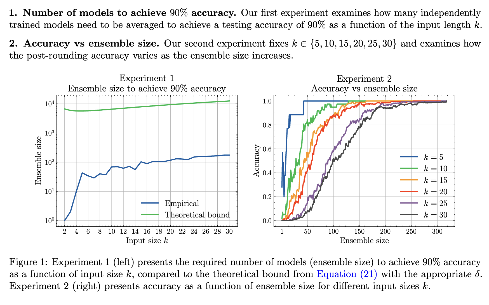

<h2>PermLearn&nbsp;&nbsp;  <a href='https://arxiv.org/abs/2502.16763'></a> </h2> 

  <br>
  <p>This repository contains the code for the paper <b>Exact Learning of Permutations for Nonzero Binary Inputs with Logarithmic Training Size and Quadratic Ensemble Complexity</b> that reproduces the following results:</p>
<p align="center">
  
</p>

To run the experiments presented in the paper, first install the necessary dependencies by executing the following command:

```bash
pip install -r requirements.txt
```
There are two scripts available for running the experiments:
- `experiment_1.sh`: Generates the results for the left plot in Figure 1.
- `experiment_2.sh`: Generates the results for the right plot in Figure 1.
